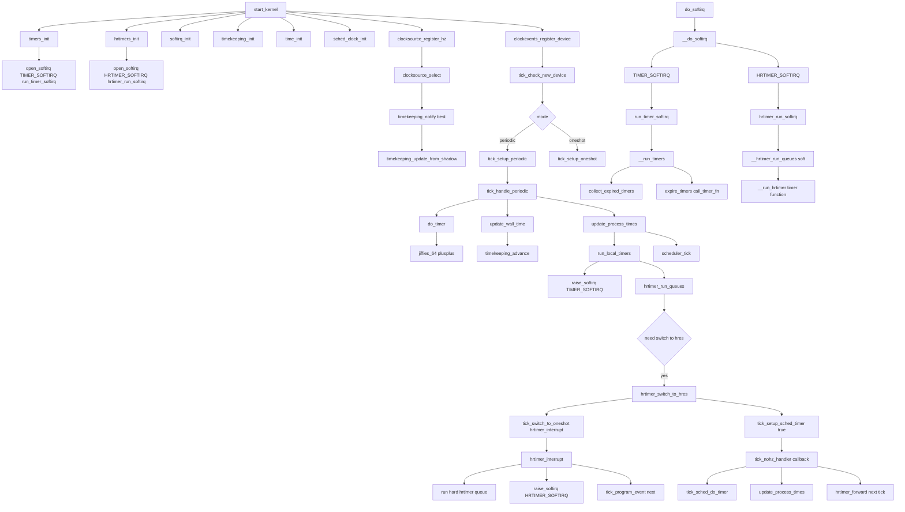

# Linux Clock Timer 一页调用链总图

> 基于 `clock_timer.c` 整理，并按 `~/qemu/linux` 实际代码校验：覆盖初始化、periodic/hres 运行、timer/hrtimer softirq 执行路径。

## 1) 总体调用链（Mermaid）

## 2) 阅读要点

- **clocksource -> timekeeping**：解决“现在几点”。
- **clockevents -> tick**：解决“下次何时触发中断”。
- **periodic 与 hres**：做的是同一组业务动作（推进时间、调度记账、安排下一次触发），仅触发机制不同。
- **timer 与 hrtimer 并行**：分别挂在 `TIMER_SOFTIRQ` 与 `HRTIMER_SOFTIRQ`，精度和数据结构不同。

## 3) 三个高频问题速记

1. **谁推进 `jiffies`？**  
   `do_timer()` / `tick_sched_do_timer()`。
2. **谁更新 wall time？**  
   `update_wall_time()` -> `timekeeping_advance()` -> `timekeeping_update_from_shadow()`。
3. **定时器回调在哪里跑？**  
   普通 timer 在 `run_timer_softirq()`，soft hrtimer 在 `hrtimer_run_softirq()`，hard hrtimer 在 `hrtimer_interrupt()` 中断路径。
