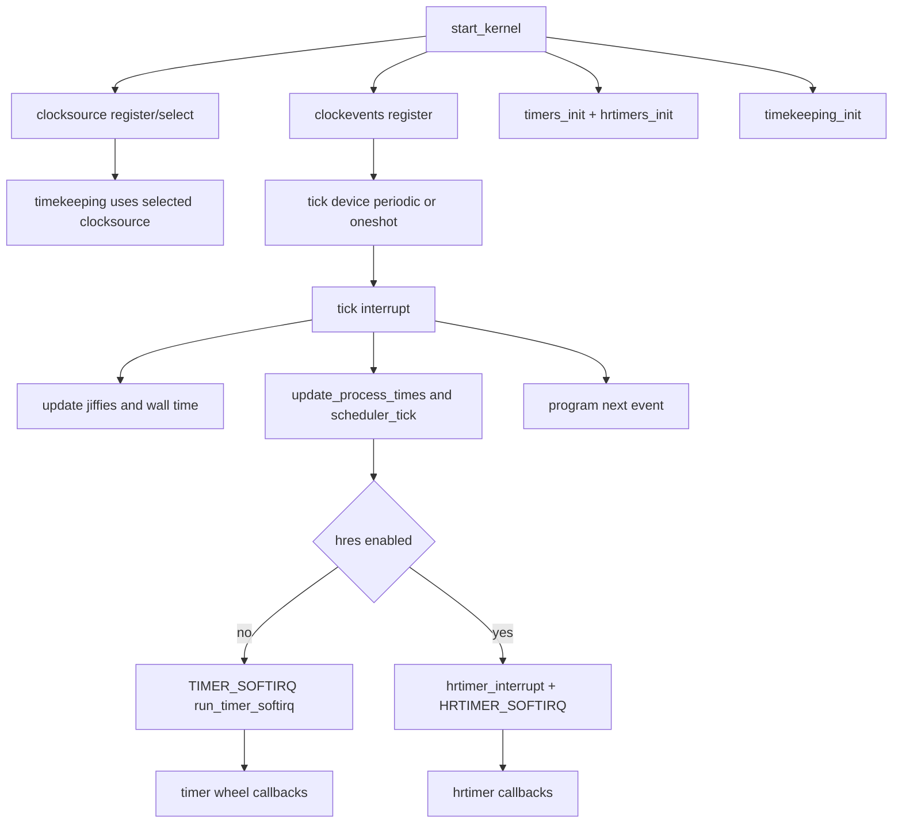

# Linux Clock Timer 简化总图（评审版）

> 面向汇报/评审：只保留主干路径，突出“谁提供时间、谁触发中断、谁执行定时器”。

## 1) 极简调用链

## 2) 一句话职责划分

- **clocksource**：提供“现在几点”的硬件时间读取。
- **clockevents**：提供“下一次何时中断”的硬件编程能力。
- **timekeeping**：把硬件计数变成系统可用时间（monotonic/realtime）。
- **tick**：每次中断推进时间、调度和下一次触发。
- **timer/hrtimer**：承载业务定时器回调（普通/高精度两套）。

## 3) 评审关注点（建议）

- periodic -> oneshot/hres 切换条件是否满足。
- 回调是否在原子上下文中执行了不可睡眠操作。
- 删除/停止定时器时是否处理并发与生命周期。
